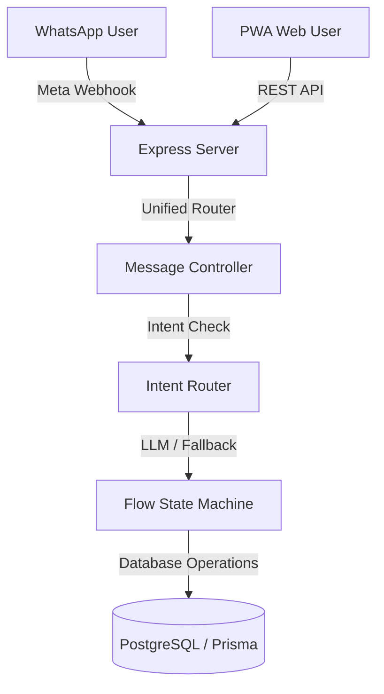

# Architecture Diagram

```mermaid
graph TD
    WhatsApp[WhatsApp User] -->|Meta Webhook| Express[Express Server]
    PWA[PWA Web User] -->|REST API| Express
    Express -->|Unified Router| Controller[Message Controller]
    Controller -->|Intent Check| IntentRouter[Intent Router]
    IntentRouter -->|LLM / Fallback| FlowService[Flow State Machine]
    FlowService -->|Database Operations| DB[(PostgreSQL / Prisma)]
```
