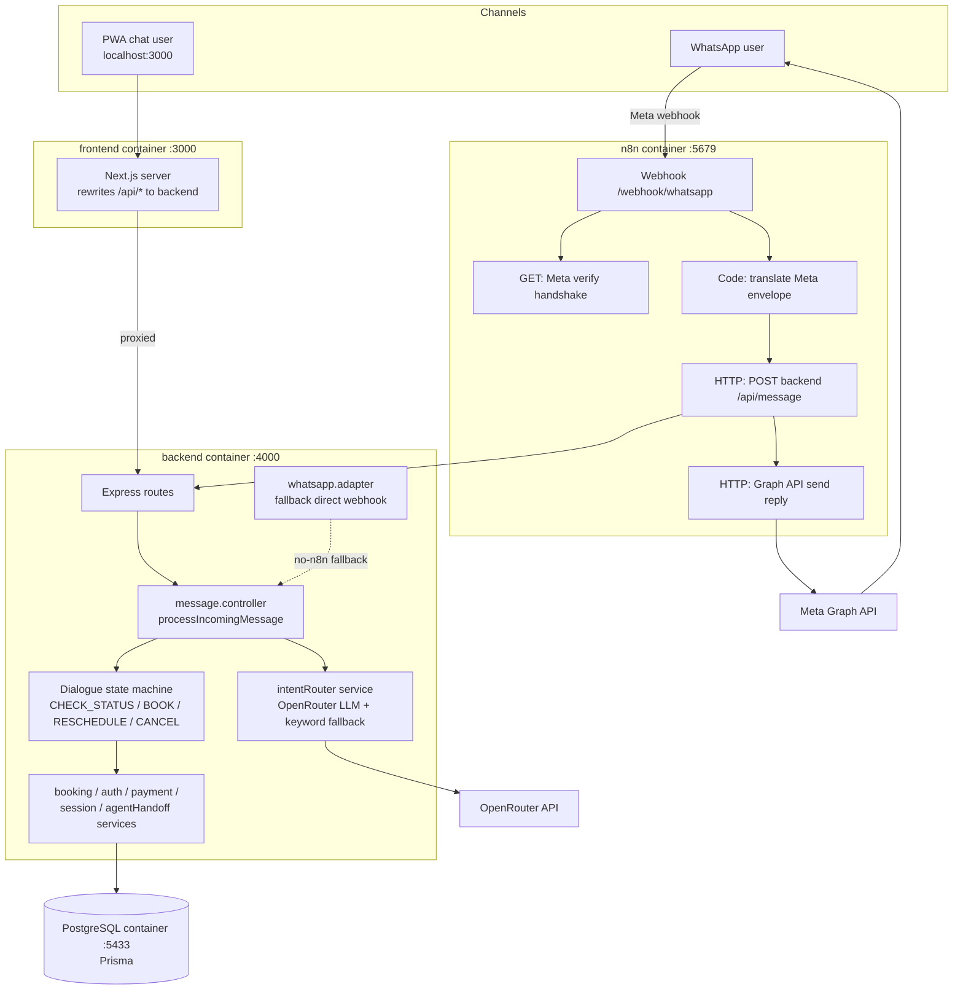
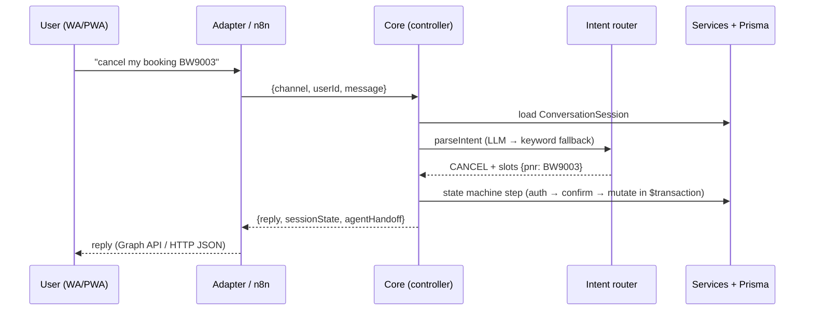

# Architecture

## System overview (Docker Compose)

## Key decisions

- **Channel-agnostic core.** All conversation logic lives behind `processIncomingMessage(payload)`. The PWA hits it via `POST /api/message`; WhatsApp reaches the same function through n8n (primary) or the Express adapter (fallback). Adapters only translate message formats — no business logic.
- **n8n as the WhatsApp orchestration layer.** The webhook handshake, envelope translation, backend call, and Graph API reply are a visual, editable workflow (`n8n/workflows/bluewings-whatsapp.json`), auto-imported and activated when the container starts.
- **LLM with a deterministic safety net.** OpenRouter (comma-separated model fallback list, max 3) parses intent; output is zod-validated. On timeout (9s), non-200, invalid JSON, or confidence < 0.55, a keyword router takes over — an LLM outage never breaks a flow. Mid-flow inputs (slot values like "BOM" or "yes") skip the LLM entirely.
- **Dialogue state in the database.** `ConversationSession` stores flow, step, slots, and the handoff flag per (channel, userId), so conversations survive restarts and work identically across channels.
- **All booking mutations in `prisma.$transaction()`** — no partial writes.

## Conversation lifecycle

