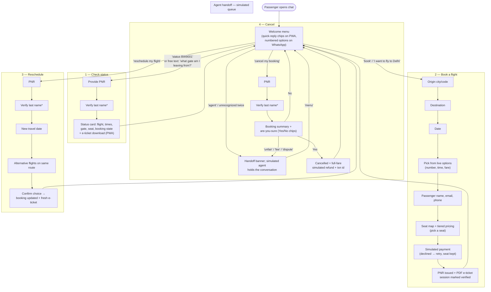

# Customer Journey — BlueWings Conversational Booking & Servicing

The passenger persona used throughout: **Priya**, a domestic traveler who booked
BOM → DEL and manages everything from her phone. She never calls the contact
centre — every journey below happens in a single chat thread (WhatsApp or the
installable PWA), with the same conversation logic on both channels.

## Journey map (all four flows)

\* **Verify once per session**: after one successful PNR + last-name check, servicing
the same PNR again (status → cancel → reschedule) skips re-verification. A different
PNR asks again. A new booking marks its PNR verified automatically.

## Narrative walkthroughs

### Journey 1 — "Which gate am I at?" (status, ~20 seconds)
1. Priya types *"what gate does my flight leave from? ref BW9001"* — the LLM
   extracts intent **CHECK_STATUS** and the PNR in one turn, so the bot only asks
   for her last name.
2. She replies *"Doe"*. The bot returns flight, departure time (IST), gate, seat,
   and status; on the PWA a **Download e-ticket** button appears.
3. Wrong last name? Polite rejection, flow resets, nothing leaks.

### Journey 2 — Booking (~90 seconds)
1. *"book a flight"* → the bot asks origin. City names work (*"mumbai"* → BOM).
   (Power users can do it in one line: *"book mumbai to delhi on 2026-07-06"*.)
2. Destination, then date (`YYYY-MM-DD`). Unserved routes/dates get a helpful
   answer (which airports we fly from, which dates have flights) instead of a dead end.
3. She picks a flight from the numbered options, gives name → email → phone.
4. **Seat selection**: the bot shows a seat map (with an image on the PWA) and the
   available seats; each seat is priced by class (premium vs standard, window/aisle/
   middle). She taps one.
5. Payment is simulated on the fare + seat total; a decline (test path) keeps her
   seat and just asks for another payment number.
6. The bot confirms with **PNR, seat, total paid, transaction ref** and the PDF
   e-ticket. Her session is now verified for that PNR — follow-up servicing needs
   no re-auth.

### Journey 3 — Plans changed (reschedule, ~45 seconds)
1. *"reschedule my flight BW9002"* → last-name check (skipped if already verified).
2. New date → alternatives on the same route with times and fares.
3. One tap/reply to confirm: status becomes RESCHEDULED, new e-ticket issued.

### Journey 4 — Cancelling (~30 seconds)
1. *"cancel my booking BW9003"* → verification → booking summary with an explicit
   **Yes / No** confirmation (chips on PWA).
2. *Yes* → cancelled, full simulated refund with transaction id.
3. If she disputes fees or is upset, dispute keywords divert her to the agent queue.

### Journey 5 — Escalation and coming back
- Explicit (*"talk to a human"*), out-of-scope requests, or **two consecutive
  unrecognized messages** put Priya in a simulated agent queue with a clear banner.
- She's never trapped: typing **menu** (or the *Back to menu* chip) returns her to
  the assistant instantly, with the session reset.

## Experience principles applied

| Principle | Where it shows up |
|---|---|
| Never go silent | Every path — including server errors — returns a friendly reply |
| Meet users' language | LLM intent parsing (free text), city-name → airport-code mapping |
| Don't re-ask what you know | PNR slot extraction from the first message; verify-once-per-session auth |
| Confirm before destructive acts | Cancellation requires explicit YES; NO aborts cleanly |
| Always offer an exit | 'menu' works everywhere, including inside the agent queue |
| Same brain, every channel | PWA and WhatsApp hit the same `/api/message` core; chips degrade to numbered text |
