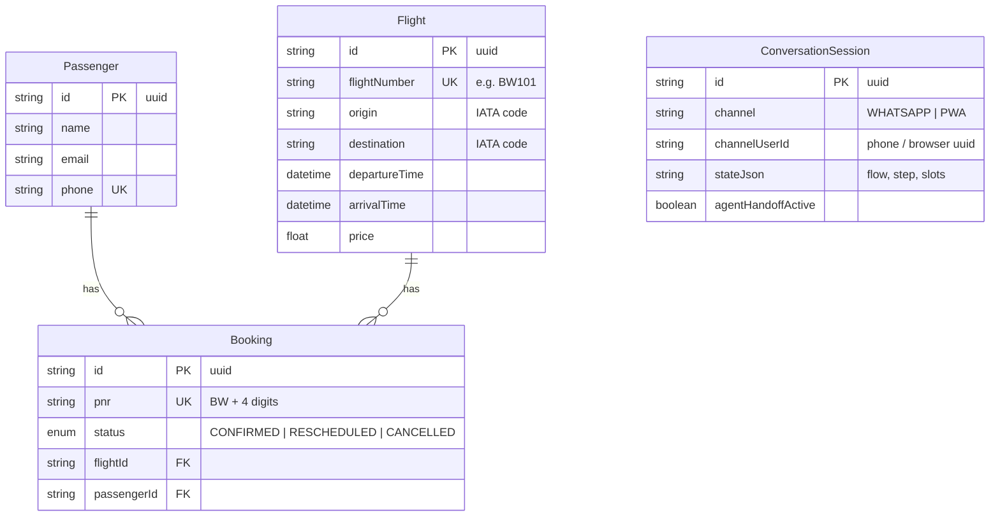

# Database Schema

PostgreSQL via Prisma. Source of truth: [`backend/prisma/schema.prisma`](../backend/prisma/schema.prisma); migrations in `backend/prisma/migrations/`.

## Notes

- **`Booking.pnr`** is the user-facing reference (`BW` + 4 digits), generated
  uniquely inside the booking transaction.
- **`ConversationSession`** has a unique compound key `(channel, channelUserId)` —
  one live conversation per user per channel. `stateJson` holds the dialogue
  state machine's position: `{ currentFlow, step, slots, auth, consecutiveFailedParses }`.
- **Rescheduling** repoints `Booking.flightId` and sets status `RESCHEDULED`;
  cancelling sets `CANCELLED`. History/audit tables are out of MVP scope.
- All booking mutations run inside `prisma.$transaction()`.

## Seed data (`backend/prisma/seed.ts`)

- ~96 flights: 6 routes (BOM/DEL/BLR pairs) × 8 days × morning + evening
- 5 passengers, 5 bookings — **BW9001–BW9004** confirmed, **BW9005** cancelled
- Demo login: PNR `BW9001`, last name `Doe`
