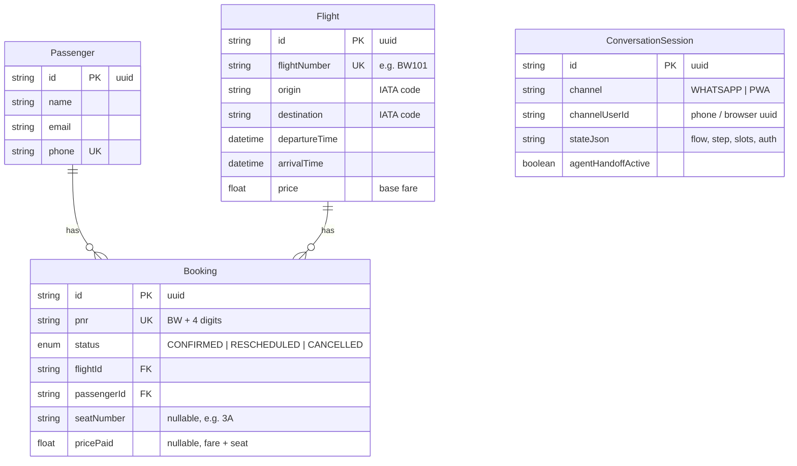

# Database Schema

PostgreSQL via Prisma. Source of truth: [`backend/prisma/schema.prisma`](../backend/prisma/schema.prisma); migrations in `backend/prisma/migrations/`.

## Notes

- **`Booking.pnr`** is the user-facing reference (`BW` + 4 digits), generated
  uniquely inside the booking transaction.
- **`Booking.seatNumber` / `Booking.pricePaid`** (nullable — added in migration
  `20260703034638_add_seat_and_price_to_booking`) capture the chosen seat and the
  total charged (base fare + seat-class adjustment). Null on legacy/seed bookings
  that never went through seat selection; the status/e-ticket views fall back to a
  deterministic seat derived from the PNR.
- **`ConversationSession`** has a unique compound key `(channel, channelUserId)` —
  one live conversation per user per channel. `stateJson` holds the dialogue state
  machine's position: `{ currentFlow, step, slots, auth, consecutiveFailedParses,
  pendingNotice }`. Verified identity and proactive delay notices live here too, so
  they survive restarts and are identical across WhatsApp and the PWA.
- **Rescheduling** repoints `Booking.flightId` and sets status `RESCHEDULED`;
  cancelling sets `CANCELLED`. History/audit tables are out of MVP scope.
- All booking mutations run inside `prisma.$transaction()` — no partial writes.

## Seat pricing (derived, not stored per-seat)

Seat class and price adjustment are computed from the seat label at booking time:

| Rows | Class | Window (A/F) | Aisle (C/D) | Middle (B/E) |
|------|-------|--------------|-------------|--------------|
| 1–2  | Premium  | +₹1000 | +₹900 | +₹800 |
| 3–5  | Standard | +₹300  | +₹200 | +₹0   |

Occupied seats for a flight are read live from other bookings' `seatNumber`, so
the seat map never double-books.

## Seed data (`backend/prisma/seed.ts`)

- **12 airports** (BOM, DEL, BLR, AMD, HYD, MAA, CCU, PNQ, COK, JAI, GOI, LKO) →
  every ordered pair = **132 routes**, × 8 days × (morning + evening) ≈ **2112 flights**
- 5 passengers, 5 bookings — **BW9001–BW9004** confirmed, **BW9005** cancelled
- Demo login: PNR `BW9001`, last name `Doe`
